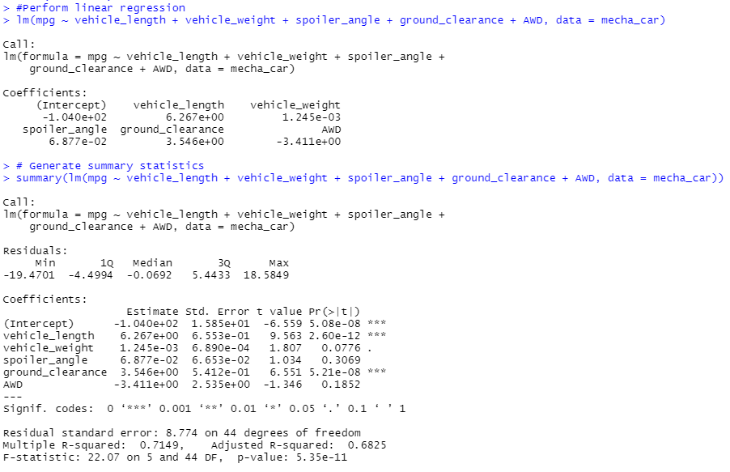
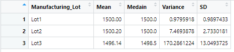
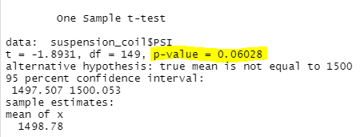
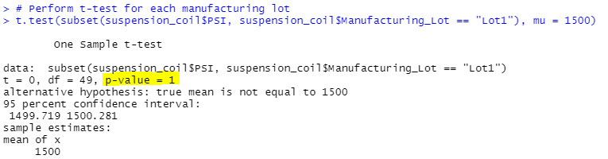
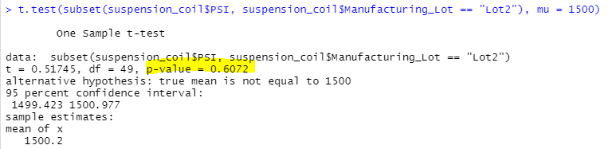
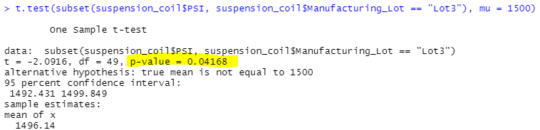

# MechaCar_Statistical_Analysis

## Linear Regression to Predict MPG

- Which variables/coefficients provided a non-random amount of variance to the mpg values in the dataset?
- As shown in the value results above, vehicle length and ground clearance provide a significant impact on the mpg values. 

- Is the slope of the linear model considered to be zero? Why or why not?
- The p-value of our linear regression analysis is smaller than a significance level of 0.05 so we can say that there is enough evidence to say the slope of our linear model is not zero. 

- Does this linear model predict mpg of MechaCar prototypes effectively? Why or why not?
- Yes, as shown in our linear regression model the R-Squared value is 71%.

## Summary Statistics on Suspension Coils
- Summary Table for all manufacturing lots

- Summary table for each manufacturing lot

- The design specifications for the MechaCar suspension coils dictate that the variance of the suspension coils must not exceed 100 pounds per square inch. Does the current manufacturing data meet this design specification for all manufacturing lots in total and each lot individually? Why or why not?

- As shown in the data above the current manufacturing data does meet the design specification for all manufacturing lots in total because the variance is 62.29 and does not exceed the 100 pounds per square inch requirement

- Individually, Lot 3 is the only manufacture that does not meet the specification because as shown in the variance of 170 pounds per square inch they are exceeding the 100 pounds per square inch. 

## T-Tests on Suspension Coils

- With a significance level of 0.05 percent our p-value of 0.006 is above our significance level so we do not have enough evidence to reject the null hypothesis. 

- For Lot 1 with our p-value of 1 above our significance level we do not have enough evidence to reject the null hypothesis and the two means are similiar.

- For Lot 2 with our p-value of 0.60 above our significance level we do not have enough evidence to reject the null hypothesis and the two means are similiar.

- For Lot 2 with our p-value of 0.04 being lower than our significance level of 0.05 we can say that we do have enough evidence to reject the null hypothesis and that the two means are different. 

## Study Design: MechaCar vs Competition
- When comparing the MechaCar against their competition I would reccommend using the ANOVA test to compare both datasets in categories that would be important to the buyer such as, fuel efficiency, safety rating, maintenance cost, and most importantly the overall cost of the vehicle. I chose the ANOVA test is able to test to see if the means from multiple different samples are significantly similar or different.